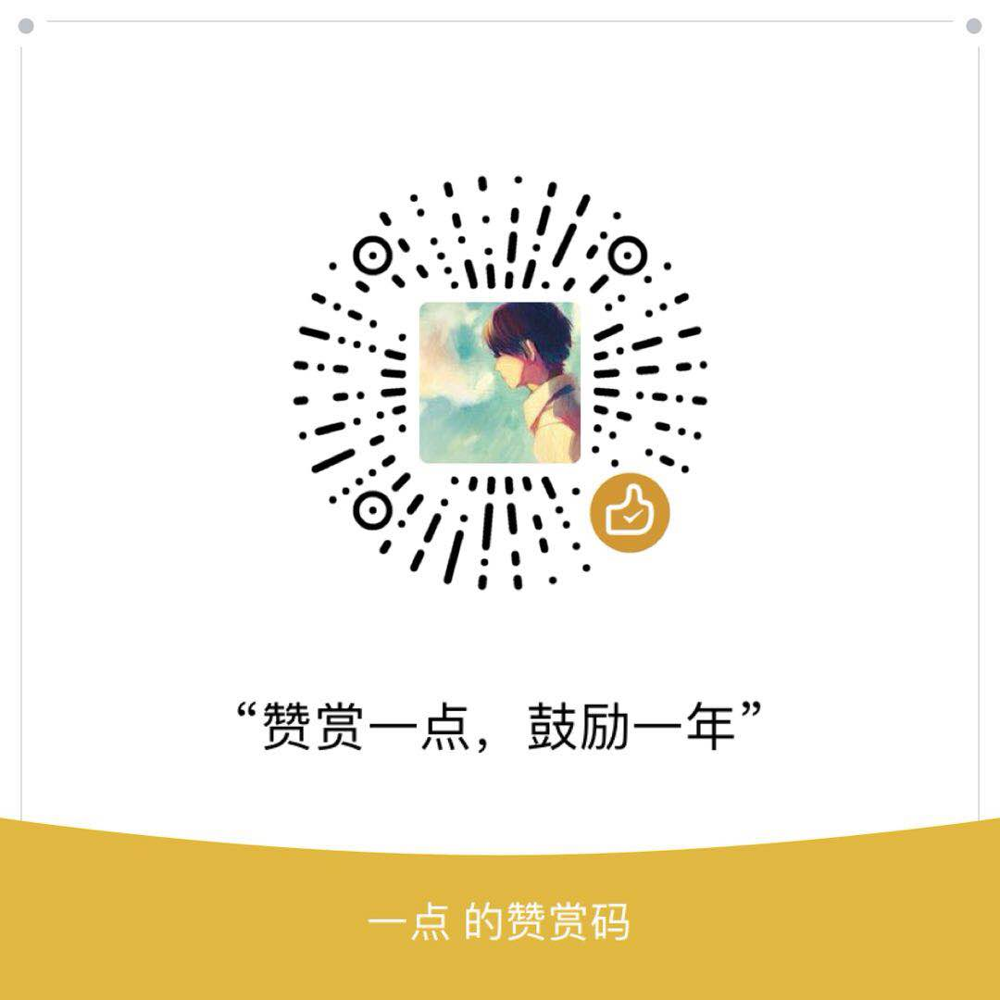

<h1 align="center">vue-ele-admin-pure</h1>
<p align="center">
  <a href="https://github.com/vuejs/vue-cli">
    
  </a>
  <a href="https://github.com/vuejs/vue">
    
  </a>
  <a href="https://github.com/ElemeFE/element">
    
  </a>
  <a href="https://github.com/vuejs/vuex">
    
  </a>
  <a href="https://github.com/vuejs/vue-router">
    
  </a>

  <a href="https://github.com/axios/axios">
    
  </a>
  <a href="https://github.com/yourVictor/vue-ele-admin-pure/blob/master/LICENSE">
    
  </a>
</p>

# 预览
- [在线预览](https://yourvictor.github.io/vue-ele-admin-pure)

# 前言
- 纯净精致版中大后台管理系统
# 功能
- 登录/退出
- 国际化
- MOCK数据
- 自定义meta
- async/await
- 骨架屏
- 响应式布局【手机/PC】
- 多色图标
- 权限控制
- 自定义主题
- 多环境打包发布
- 本地Sever预览
- PWA（性能优化）
- CDN（性能优化）
# 创建项目
### 1、初始化：克隆项目到本地
```
$: git clone https://github.com/yourVictor/vue-ele-admin-pure.git my-project
```
### 2、安装依赖
```
$: cd my-project
$: yarn install    |  npm install
$: yarn run serve  |  npm run serve  // 开放环境预览
```
# 配置
### 1、打包环境配置
不同环境使用不同的配置文件【env: 基础配置文件，env.test: 测试环境配置文件，env.uat: uat环境配置文件，env.prod: env.production: 按日期保存每次打包生产环境的记录】

```
NODE_ENV = 'development'          // 编译环境：可取development、production
baseUrl = '/'                     // 项目资源访问路径
VUE_APP_ROUTER_BASE = '/'         // 路由访问路径
VUE_APP_ROUTER_MODE = 'history'   // 路由模式：可取hash、history[服务端需配置支持]
VUE_APP_API = ''                  // 项目接口BASE_API
VUE_APP_MOCK = true               // 项目是否使用MOCK模拟数据
```
### 2、全局样式配置【位置：src/styles/__variables.scss】
```
// global css 网站主色调 RGB值--------------------------------------------
$red: 10;
$green: 160;
$blue: 100;
//body css set-------------------------------------------------
$color-normal: #494949;       // 默认字体颜色
$color-sub: #8f8f8f;          // 副标题字体颜色
$color-input-holder: #d9d9d9;  // input placeHolder字体颜色
$color-border: #e4e4e4;       // 边框颜色
$color-border-sub: #efefef;
$color-shadow: rgba(210, 210, 210, 0.54); // 阴影颜色
$color-active: rgb($red,$green,$blue);    // 网站主色
$color-body-bg: #fff;                      // 网页背景颜色
$color-scroll-bar: rgba(0, 0, 0, 0.4);     // 滚动条颜色
$theme-aside: #fff;                       // 侧边菜单亮色
$theme-aside-dark: #4b4b4b;                // 侧边菜单暗色

$size-normal: 12px;        // 默认字体大小
$size-icon: 24px;    // 默认字体图标大小
$size-line-height: 1;
$size-scroll-bar: 8;            // 滚动条宽度
$width-sidebar-min: 46px;       // 侧边栏收起的宽度
$width-sidebar-max: 200px;      // 侧边栏展开的宽度
$height-header-bar: 50px;       // headerBar高度
```
### 3、字体图标、多色字体图标配置【位置：src/styles/_fontIcon.scss】
```
1、进阿里图标库挑选需要的图标【注册>新建项目>挑选图标>生成css文件>拷贝到_fontIcon.scss】
   https://www.iconfont.cn/
   备注：上面基本上有你想要的所有图标

2、使用
   2.1：单色字体图标（***代表不同的图标名称）
       <i class="el-icon-extend-***"></i>

   2.2：多色字体图标（***代表不同的图标名称）
       <svg class="icon" aria-hidden="true">
        <use xlink:href="#el-icon-extend-***"></use>
       </svg>
```

### 3、路由相关配置【位置：src/routers/*.js】
#### 3.1、应用场景1：权限控制（控制级别：菜单。且需要后端配合）
配置：菜单路由的meta字段增加【roles: ['admin', ...]】。用户在登录以后，会根据后端返回用户的角色来匹配对应的页面路由
```
export default {
  path: '/settings',
  name: 'settings',
  redirect: '/settings/base',
  meta: { title: 'routes.settings', icon: 'el-icon-extend-dashboard', roles: ['admin'] },
  component: Container,
  children: [
    {
      path: 'base',
      name: 'baseSettings',
      meta: { title: 'routes.baseSettings', showParent: true },
      component: () => import(/* webpackChunkName: "setting" */ '@/views/settings/base/index.vue')
    }
  ]
}
```
  
#### 3.2、应用场景2：在一个具有搜索或者分页的列表页浏览，点击某一条记录跳转到详情页，浏览或操作完返回，发现搜索条件全部没了，且分页又跳到第1页
配置：在对应列表页面路由的meta增加【keepAlive: true】即可，如下所示
```
{
  path: 'list',
  name: 'memberList',
  meta: { title: 'routes.memberList', showParent: true, keepAlive: true },
  component: () => import(/* webpackChunkName: "member" */ '@/views/member/list/index.vue')
}

//备注：如需重置，在详情页，点击菜单回到列表会重置搜索条件和分页
```

#### 3.3、应用场景3：一个列表页的入口在菜单，对应的详情页的入口在列表页。访问详情页，这时候刷新页面，发现菜单并不会定位到其对应的列表页菜单
配置：在详情页面路由的meta增加【index: XXX】即可，XXX为对应列表页的路由完整path
```
{
  path: '/member',
  name: 'member',
  redirect: '/member/list',
  meta: { title: 'routes.member', icon: 'el-icon-extend-dashboard' },
  component: Container,
  children: [
    {
      path: 'list',
      name: 'memberList',
      meta: { title: 'routes.memberList', showParent: true, keepAlive: true },
      component: () => import(/* webpackChunkName: "member" */ '@/views/member/list/index.vue')
    },
    {
      path: ':id/detail',
      name: 'memberDetail',
      meta: { title: 'routes.memberDetail', hidden: true, index: '/member/list' },
      component: () => import(/* webpackChunkName: "member" */ '@/views/member/detail/index.vue')
    }
  ]
}
```
#### 3.4、应用场景4：现有的路由配置，如果一个菜单只有一个子菜单，则默认不会显示父级菜单。
配置：在对应页面路由meta增加【showParent: true】即可显示父级菜单
```
{
  path: '/settings',
  name: 'settings',
  redirect: '/settings/base',
  meta: { title: 'routes.settings', icon: 'el-icon-extend-dashboard', roles: ['admin'] },
  component: Container,
  children: [
    {
      path: 'base',
      name: 'baseSettings',
      meta: { title: 'routes.baseSettings', showParent: true },
      component: () => import(/* webpackChunkName: "setting" */ '@/views/settings/base/index.vue')
    }
  ]
}
```

# 打包发布
### 1、测试环境(发布目录dist/test)
```
$: yarn run build:test  |  npm run build:test
```
### 2、UAT环境(发布目录dist/uat)
```
$: yarn run build:uat   |  npm run build:uat
```
### 3、正式环境(发布目录dist/prod)
```
$: yarn run build:prod  |  npm run build:prod
```
# 微信赞赏


# 其它自定义配置
See [Configuration Reference](https://cli.vuejs.org/config/).
